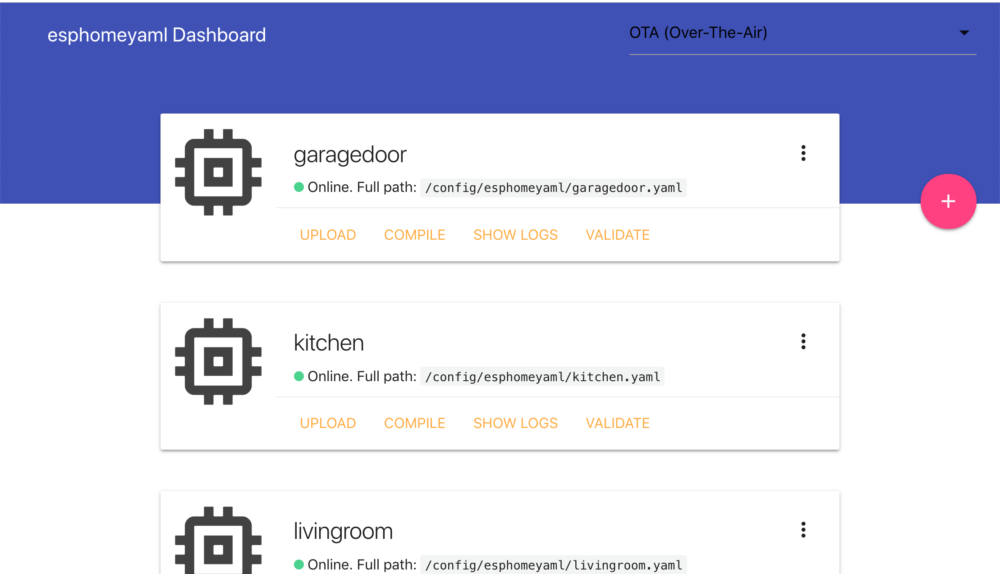
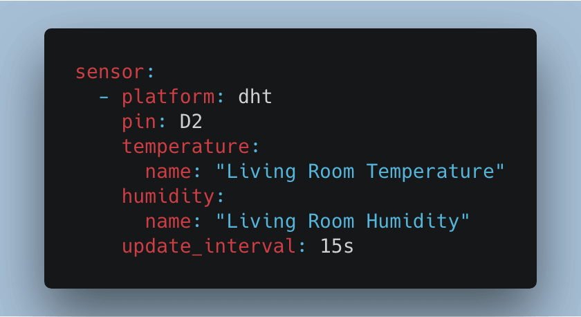
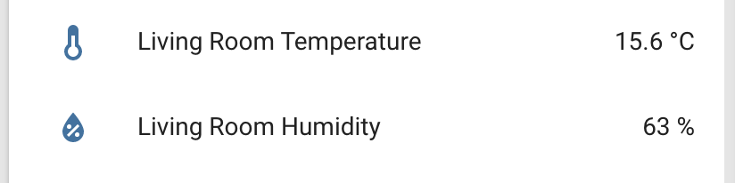

# Esphomeyaml HassIO Add-On

[](https://esphomelib.com/esphomeyaml/index.html)

## WARNING! THIS IS AN EDGE VERSION!

You're viewing the edge (latest build) of the esphomeyaml add-on. This
contains the latest source code with all the latest features. However, the
code in this version of the add-on is unstable and might break at any moment.

It is intended for:

- people who want to test the latest features.
- people who can manually re-flash their node via USB if something breaks.
- Developers

## About

This add-on allows you to manage and program your ESP8266 and ESP32 based microcontrollers
directly through HassIO **with no programming experience required**. All you need to do
is write YAML configuration files; the rest (over-the-air updates, compiling) is all
handled by esphomeyaml.

<p align="center">
</img>
</p>

[_View the esphomeyaml documentation here_](https://esphomelib.com/esphomeyaml/index.html)

## Example

With esphomeyaml, you can go from a few lines of YAML straight to a custom-made
firmware. For example, to include a [DHT22](https://esphomelib.com/esphomeyaml/components/sensor/dht.html)
temperature and humidity sensor, you just need to include 8 lines of YAML
in your configuration file:

</img>

Then just click UPLOAD and the sensor will magically appear in Home Assistant:

</img>

## Installation

To install this HassIO add-on you need to add the esphomeyaml add-on repository
first:

1. [Add esphomeyaml's HassIO add-ons repository](https://github.com/OttoWinter/esphomeyaml) to your HassIO instance. You can do this by navigating to the "Add-on Store" tab in the HassIO panel and then entering https://github.com/OttoWinter/esphomeyaml in the "Add new repository by URL" field.
2. Now scroll down to the bottom of the page and select the "esphomeyaml-edge" add-on.
3. Press install to download the add-on and unpack it on your machine. This can take some time.
4. Optional: If you're using SSL certificates and want to encrypt your communication to this add-on, please enter `true` into the `ssl` field and set the `fullchain` and `certfile` options accordingly.
5. Start the add-on, check the logs of the add-on to see if everything went well.
6. Click "OPEN WEB UI" to open the esphomeyaml dashboard. You will be asked for your Home Assistant credentials - esphomeyaml uses HassIO's authentication system to log you in.

**NOTE**: Installation on RPis running in 64-bit mode is currently not possible. Please use the 32-bit variant of HassOS instead.

You can view the esphomeyaml docs here: https://esphomelib.com/esphomeyaml/index.html

## Configuration

**Note**: _Remember to restart the add-on when the configuration is changed._

Example add-on configuration:

```json
{
  "ssl": false,
  "certfile": "fullchain.pem",
  "keyfile": "privkey.pem"
}
```

### Option: `ssl`

Enables/Disables encrypted SSL (HTTPS) connections to the web server of this add-on. Set it to `true` to encrypt communications, `false` otherwise. Please note that if you set this to `true` you must also specify a `certfile` and `keyfile`.

### Option: `certfile`

The certificate file to use for SSL.

**Note**: _The file MUST be stored in `/ssl/`, which is the default for Hass.io_

### Option: `keyfile`

The private key file to use for SSL.

**Note**: _The file MUST be stored in `/ssl/`, which is the default for Hass.io_

### Option: `leave_front_door_open`

Adding this option to the add-on configuration allows you to disable
authentication by setting it to `true`.

## Embedding into Home Assistant

It is possible to embed the esphomeyaml dashboard directly into
Home Assistant, allowing you to access your ESP nodes through
the Home Assistant frontend using the `panel_iframe` component.

Example configuration:

```yaml
panel_iframe:
  esphomeyaml:
    title: esphomeyaml Dashboard
    icon: mdi:code-brackets
    url: https://addres.to.your.hass.io:6052
```
